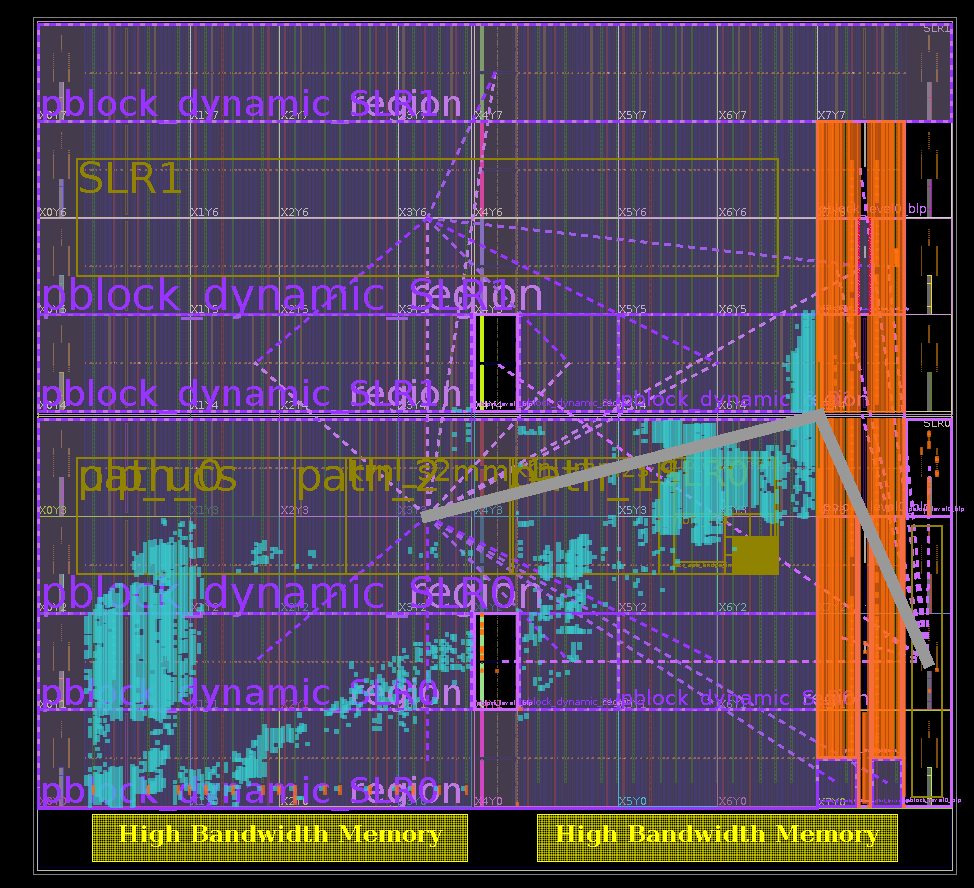

Supported platforms are:
- `xilinx_u55n_gen3x4_xdma_2_202110_1` for varium-1100
- `xilinx_aws-vu9p-f1_shell-v04261818_201920_3` for aws

This "infrastructure" provides a few things
- `scripts/run_build.py` to easily build a xclbin
- Some examples as reference

Some other things i'd like to figure out
- Figure out what exactly needs to do into `kernel_ports.tcl` and document it.
- Automatically generating the `kernel_ports.tcl` script. This interacts with
  the xilinx IP packager, and the API is quite hard to work with
- Supporting explicit configs for HLS kernels (which I think we can make use of)

# Prerequisites for building on AWS

Setup the Vitus setup scripts
```
source ../aws-fpga/vitus_setup.sh
source ../aws-fpga/vitis_runtime_setup.sh
```

# Examples

Examples with hardcaml RTL kernels
- [loopback](examples/loopback) - example with a RTL kernel + 2 cpp kernels
  converting `m_axi` to `axis` doing loopback with byte swapping and a simple
  register interface. This is very close to a "hello world" example.

Examples with C++ kernels
- [stream\_reverse](examples/stream_reverse) - example C++ kernel that performs
  the reads and writes as required for the NTT core. This is the "experimental
  playground" for the vitis-facing layer of the NTT core.

Examples copied from the Vitis Accel Examples repository
- [rtl\_adder\_streams](examples/rtl_adder_streams)
- [rtl\_vadd](examples/rtl_vadd)
- [rtl\_vadd\_2kernels](examples/rtl_vadd_2kernels)
- [rtl\_vadd\_mixed\_c\_vadd](examples/rtl_vadd_mixed_c_vadd)

# How to compile a target

Structure your project as follows:

```
fpga/
  foo_rtl_kernel/
    kernel_ports.tcl  # A script to be run in the IP-packaging flow to
                      # specify axis/maxi/axilite ports are used.
    foo.sv
    foo2.v
    dune  # Optionally, a dune file, if the verilog is generated from hardcaml
  bar_cpp_kernel/
    bar.cpp  # Kernel code
  my_top_level.cfg  # An optional top-level configuration file. This is used in
                    # v++ linking
```

Then run the following

```bash
../../../scripts/run_build.py \
	--top-level-name my_top_level \
	--platform varium-c1100 \
	--build-dir build \
	--build-target hw_emu \
	--cfg my_top_level.cfg \
  foo_rtl_kernel \
  bar_cpp_kernel:cpp

# If --build-target is not specified, the script will generate a project without
# compiling it
```

The [loopback example](examples/loopback) is the best illustration of this
project structure. Additionally, there is a `compile_hw_emu.sh` script in
`fpga/`.

Some limitations are:
- all systemverilog/verilog/cpp files are expected
- VHDL and opencl not supported
- The script doesn't, and will not, deal with host code at all!

Under the hood, the script performs the following
- invokes v++ for C++ kernels, this generates an .xo file
- invokes a bunch of tcl scripts to package the RTL kernels as an IP, then
  calls `package_xo` to generate a .xo file.
- invokes v++ to link the .xo files into a .link.xclbin
- invokes v++ again to packaage the .link.xclbin into a .xclbin

# Debugging with xsim

Vitis supports running your test application with a waveform dump. By default,
it provides a limited high-level waveform (which might suffice for your
debugging!).

Add the following to `xrt.ini` , which will bring up xsim while our test app is
running.

```
[Emulation]
debug_mode=gui
```

(Alternatively, you can see `debug_mode=batch`, and run
`xsim the_waveform_file.wdb` after the simulation)

If you need a more detailed waveform,

1. you'll need to relink your kernel with the following property

```
[vivado]
prop=fileset.sim_1.xsim.elaborate.debug_level=all
```

2. Add the following to your xsim in xrt.ini. Note that `CURRENT_DIRECTORY`
has to be an absolute path, as xsim doesn't run in the same directory as your
application. (Note that xsim will not error even if
`CURRENT_DIRECTORY/xsim.tcl` does not exist)

```
[Emulation]
debug_mode=gui  # Or batch, if you prfer viewing the waveform later
user_pre_sim_script=CURRENT_DIRECTORY/xsim.tcl
```

3. Run your simulation. When you open xsim, you'll see a limited set of waves
in the viewer. To see the other waves, navigate to your kernel in the "Scope"
window.

4. (Only if running in `debug_mode=batch`) Open the generated `.wdb` file by
running `xsim -gui foo.wdb`

See [the loopback example](examples/loopback) for more example of this in
action.

# Introspecting a HW Build

When building the loopback example for the varium-c1100, I see a vivado.log in
`build/_x.hw.xilinx_u55n_gen3x4_xdma_2_202110_1/link/vivado/vpl/vivado.log`. It
refers to a post-route dcp in
`build/_x.hw.xilinx_u55n_gen3x4_xdma_2_202110_1/link/vivado/vpl/prj/prj.runs/impl_1/level0_wrapper_routed.dcp`

## Varium C1100

From loading the DCP on the varium C1100, I see the following:



The big things that we learn here are:
- 2 SLRs
- SLR0 (the bottom one) is closer to the HBMs

# Resources

General notes about vitis
- [Xilinx Kernel Execution Models](https://xilinx.github.io/XRT/master/html/xrt_kernel_executions.html)
- [Programming Model for Vitis](https://docs.xilinx.com/r/2021.2-English/ug1393-vitis-application-acceleration/Programming-Model)
- [Vitis kernel linking](https://docs.xilinx.com/r/en-US/ug1393-vitis-application-acceleration/Linking-the-Kernels) there is some useful notes about SLRs, HBM, debugging etc.
- [Vitis Linking Compiler Configuration file](https://docs.xilinx.com/r/en-US/ug1393-vitis-application-acceleration/Vitis-Compiler-Configuration-File) there are quite useful things like mapping a specific kernel to a specific SLR.

Debugging, getting waveforms and running xsim
- [Vivado setting to get Waveforms](https://support.xilinx.com/s/question/0D52E00006hpQIXSA2/how-to-get-signals-which-are-not-in-the-kernel-interface-but-between-or-inside-functions-in-the-kernel-in-waveform-under-hwemu?language=en_US)
- [xsim for waveforms](https://support.xilinx.com/s/question/0D52E00006hpNiASAU/problem-editing-xrtini-on-vitis-20201?language=en_US)

# xdma vs qdma

xdma shells do not support a direct streaming interface from host to kernel.
(That's sad...). qdma shell from u55n cards are still on the way. In fact, when
I try to link a kernel with axi stream, i got the following warning:

```
ERROR: [CFGEN 83-2284] No stream resources found that can accomodate compute unit \krnl_rtl_1.fpga_to_host\
```

Several references:
- xdma shell vs qdma shell: https://support.xilinx.com/s/question/0D52E00006hpX0aSAE/qdma-shell-alveo-u50-and-u280?language=en_US
- this forum post, i think, claims only memory mapping is supported: https://support.xilinx.com/s/question/0D52E000070Tc6gSAC/error-cfgen-832284-no-stream-resources-found-that-can-accomodate-compute-unit-krnlvadd21in1?language=en_US seems to platform
