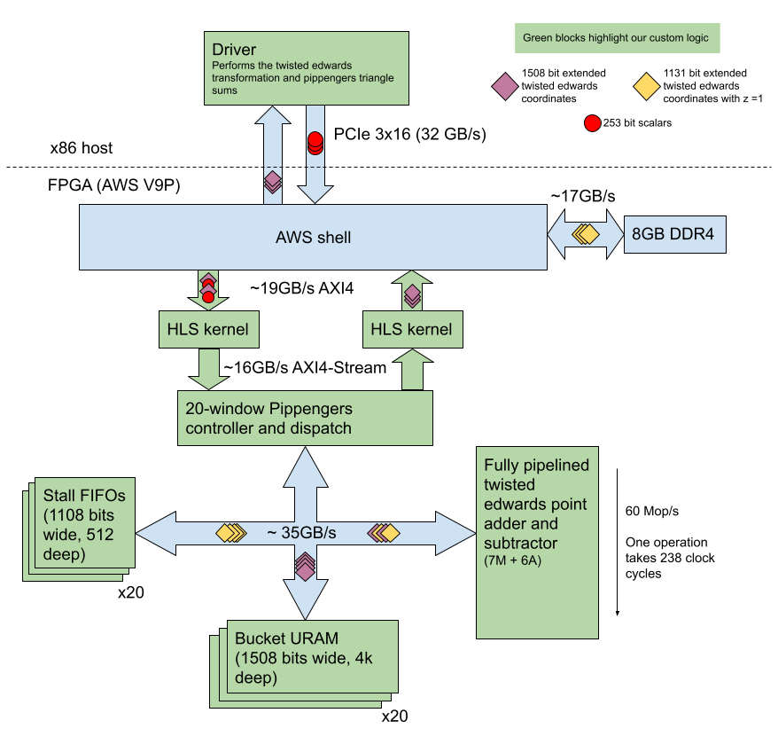

# FPGA Implementation of the MSM Pippengers algorithm

We have implemented a FPGA design that runs on a AWS F1 instance and can compute
the MSM of a large number of elliptic point and scalar pairs on the BLS12-377
curve. 

Performance is measured as per the ZPrize specs at 20.504s for 4 rounds of
2<sup>26</sup> MSMs, which equates to **13.092** Mop/s. 

Detailed instructions on re-creating these results from source are in the
[building from source](#building-the-design-from-source) and more detailed
measurement results in the [benchmarking](#benchmarking) sections below.


## Overview of the architecture

We decided to implement a heavily optimized version of [pippengers
algorithm](https://dl.acm.org/doi/abs/10.1137/0209022) in order to solve the MSM
problem.

We picked window sizes of between 12 and 13 bits, which allowed for efficient
mapping to FPGA URAM resources which are naively 4096 elements deep. Points are
transformed and pre-loaded into DDR-4, so that at run time only scalars are sent
from the host to the FPGA via PCIe. We implemented a single fully-pipelined
point adder on the FPGA which adds points to buckets as directed by the
controller until there are no more points left. The controller automatically
handles stalls (only accessing a bucket when it does not already have an
addition in-flight). Once all points have been added into buckets, the FPGA
streams back the result for the host to do the final (much smaller) triangle
summation. This approach allows us to focus on implementing a very high
performance adder on the FPGA (as these additions dominate Pippengers
algorithm), and then leaving smaller tasks for the host to perform.

The above description overly simplifies the amount of optimizations and tricks we
have implemented to get performance. A summary of the optimizations are listed
out below.

## Key optimizations

 1. Early on we decided rather than implementing all of Pippengers algorithm on
the FPGA, it would be better to only implement point additions, and focus on as
high throughput as possible. We implemented a fully pipelined adder which can
take new inputs to add every clock cycle, with a result appearing on the output
after 238 clock cycles in the final version.

 2. Implementing an adder on affine or projective coordinates requires more FPGA
resources (DSPs, LUTs, carry chains, ...), so we investigated different
transforms we could do in advance that would reduce the complexity on the FPGA.
We ended up deciding to transform to a twisted Edwards curve and extended
projective coordinates. We also do a pre-transformation on the host that allows
us to remove some of the constants required when calculating the point addition.
This requires special care as there are a sub-set of Weierstrass point that
cannot map to our selected Edwards curve. These points are so rare that in
generating 2<sup>26</sup> random points we never hit one, but we add a check in
our driver to detect these and perform point multiplication on the host if
needed. Corner case tests confirm this code works as expected.

 3. We mask PCIe latency by allowing MSM operations to start while points are
  being streamed in batches from the host. When a result is being processed we
  are also able to start the MSM on the next batch.

 4. Multiplier optimizations in the Barret reduction algorithm so that constants
    require less FPGA resources.

 5. Adder and subtractor use BRAMs as ROMs to store coefficients that can be used
  to reduce modulo adder and subtractor latency.

 6. Selecting a bucket size that allows for efficient usage of FPGA URAM,
  allowing non-uniform bucket sizes, and pblocking windows to separate SLRs in
  the FPGA to avoid routing congestion.

 7. Scalars are converted into signed form and our twisted Edwards adder is
    modified to support point subtraction, which allows all bucket memory to be
    reduced in half.

 8. Host code is optimized to allow for offloading the final triangle sum and
    bucket doubling operations.

## Block diagram

A high level block diagram showing the different data flows and modules used in
our MSM implementation.



## Resource utilization

The AWS shell uses roughly 20% of the resources available on the FPGA. We tuned
our MSM implementation to use the remaining resources as much as possible while
still being able to successfully route in Vivado.

```
+----------------------------+--------+--------+--------+--------+--------+--------+
|          Site Type         |  SLR0  |  SLR1  |  SLR2  | SLR0 % | SLR1 % | SLR2 % |
+----------------------------+--------+--------+--------+--------+--------+--------+
| CLB                        |  25089 |  39672 |  38105 |  50.93 |  80.54 |  77.35 |
|   CLBL                     |  12592 |  19723 |  18557 |  51.19 |  80.17 |  75.43 |
|   CLBM                     |  12497 |  19949 |  19548 |  50.68 |  80.90 |  79.27 |
| CLB LUTs                   | 109566 | 133493 | 146117 |  27.80 |  33.87 |  37.08 |
|   LUT as Logic             | 102296 | 118359 | 125869 |  25.96 |  30.03 |  31.94 |
|     using O5 output only   |    962 |   1351 |     13 |   0.24 |   0.34 |  <0.01 |
|     using O6 output only   |  80045 |  76731 |  79799 |  20.31 |  19.47 |  20.25 |
|     using O5 and O6        |  21289 |  40277 |  46057 |   5.40 |  10.22 |  11.69 |
|   LUT as Memory            |   7270 |  15134 |  20248 |   3.69 |   7.67 |  10.26 |
|     LUT as Distributed RAM |   7002 |   4268 |      0 |   3.55 |   2.16 |   0.00 |
|     LUT as Shift Register  |    268 |  10866 |  20248 |   0.14 |   5.51 |  10.26 |
|       using O5 output only |      0 |      0 |      0 |   0.00 |   0.00 |   0.00 |
|       using O6 output only |     96 |   4782 |   8248 |   0.05 |   2.42 |   4.18 |
|       using O5 and O6      |    172 |   6084 |  12000 |   0.09 |   3.08 |   6.08 |
| CLB Registers              | 159643 | 281789 | 294290 |  20.26 |  35.75 |  37.34 |
| CARRY8                     |   1518 |   7589 |  18131 |   3.08 |  15.41 |  36.81 |
| F7 Muxes                   |   4818 |   1251 |      0 |   2.45 |   0.63 |   0.00 |
| F8 Muxes                   |    279 |    226 |      0 |   0.28 |   0.23 |   0.00 |
| F9 Muxes                   |      0 |      0 |      0 |   0.00 |   0.00 |   0.00 |
| Block RAM Tile             |  153.5 |    239 |     28 |  21.32 |  33.19 |   3.89 |
|   RAMB36/FIFO              |    152 |    235 |     24 |  21.11 |  32.64 |   3.33 |
|     RAMB36E2 only          |    128 |    235 |     24 |  17.78 |  32.64 |   3.33 |
|   RAMB18                   |      3 |      8 |      8 |   0.21 |   0.56 |   0.56 |
|     RAMB18E2 only          |      3 |      8 |      8 |   0.21 |   0.56 |   0.56 |
| URAM                       |    210 |    127 |    126 |  65.63 |  39.69 |  39.38 |
| DSPs                       |      0 |    859 |   2140 |   0.00 |  37.68 |  93.86 |
| Unique Control Sets        |   4089 |   4425 |    119 |   4.15 |   4.49 |   0.12 |
+----------------------------+--------+--------+--------+--------+--------+--------+
```

# Benchmarking

See the the test\_harness [README.md](test_fpga_harness/README.md) for
instructions on benchmarking our solution against 2<sup>26</sup> to get the
performance number required for the ZPrize competition. This section presents a
summary of those results.

## AFI-ids and measured performance

Currently our highest performance afi is:

afi-0938ad46413691732 (FPGA MSM kernel running at 278MHz)

Note each of these tests take up to 30min each as we transform 2<sup>26</sup>
affine points into their twisted Edwards representation.

Running `cargo test` to verify the result for 4 rounds of 2<sup>26</sup> MSM:

```
Running MSM of [67108864] input points (4 batches)
Streaming input scalars across 4 chunks per batch (Mask IO and Post Processing)
Running multi_scalar_mult took Ok(20.504301742s) (round = 0)
test msm_correctness ... ok
```

We can then benchmark the result to eliminate noise and get a better measurement.
Below is the total time for the same measurement as above but repeated 10 times
(the output of cargo bench in the
[test\_fpga\_harness](test_fpga_harness/README.md)). This allows us to mask the
overhead of transferring data to the FPGA and various host processing steps on
the scalar inputs that can happen in parallel. This is also the required
measurement outlined in the ZPrize specs.

```
FPGA-MSM/2**26x4        time:  [20.404 s 20.504 s 20.621 s]
```

We achieve a mean of 20.504s, which equates to **13.092** Mop/s
((4*2^26)/1000000)/20.504).

### Power

AWS allows the average power to be measured during operation:

```
sudo fpga-describe-local-image -S 0 -M
```
```
Power consumption (Vccint):
   Last measured: 51 watts
   Average: 50 watts
   Max measured: 54 watts
```

The breakdown of how long each stage takes can be printed when changed the value
of `mask_io` to `false` in `host/driver/driver.cpp` (this is not used in
benchmarking as it has lower performance):

```
[memcpy-ing scalars to special memory region] 0.28928s
[transferring scalars to gmem] 0.198263s
[Doing FPGA Computation] 4.96781s
[Copying results back from gmem] 0.00128217s
[Doing on-host postprocessing] 0.469954s
```

### Notes
 1. Because our solution offloads a non-trival amount of work to perform in
parallel to the host, you will see the best performance after a fresh reboot,
and without other CPU-intensive tasks running at the same time.
 2. When running the tests if you terminate the binary early by `ctrl-c`, it
will leave the FPGA in a bad state which requires clearing and re-programming
with these commands:

```
sudo fpga-clear-local-image  -S 0
sudo fpga-load-local-image -S 0 -I <afig-...>
```

### Historical AFIs

AFI-id | AFI-gid | git branch / Notes | 2^26 performance
------- | ------- | ----- | -----
 afi-04f8603ed1582001a | | First build with single controller, inputs and outputs not aligned. | n/a
 afi-06740c40be3315e44 | agfi-0f79d721e3edefc64 | master-b86bfd8d65490545b4ace0aab3fbae19bf027652 Single controller with 64b aligned input and output, double buffering | n/a
 afi-064af6a9ebb4349d9 | agfi-0275df76295dbc8c1 | same as above, but with tlast set via C++ | n/a
 afi-005f604b2e786b217 | agfi-0a8eb87970600ea78 | msm-1x-full-precompute-adder | [Copying scalars and points to gmem] 1.78697s, [Doing actual work] 10.8767s
 afi-071f40ea5e182fa8f | agfi-074c9451b3f89d392 | msm-1x-full-precompute-merge-axi-streams | [transferring scalars to gmem] 0.204802s, [Doing FPGA Computation] 10.8336s
 afi-071f40ea5e182fa8f | agfi-0e2c85bf4591270d3 | msm-halve-window-sizes-2 | [transferring scalars to gmem] 0.277229s, [Doing FPGA Computation] 8.10432s
 afi-0df5b1800bfbfdd54 | agfi-036994fb80202cb8d | mega-build-3-oct-1 | [transferring scalars to gmem] 0.182392s, [Doing FPGA Computation] 6.8731s
 afi-066aeb84a7663930a | agfi-0ec73e4a50c84b9fc | mega-build-3-oct-1, various timing optimizations, 250MHz, Vivado 2021.2 | [Doing FPGA Computation] 5.40025s 
 afi-0b83061a1938e28cb | agfi-043b477d73479a018 | mega-build-1-oct-2, various timing optimizations, 270MHz, Vivado 2020.2, host masking code | 4 rounds @ 20.957301742s
 afi-0938ad46413691732 | agfi-04dec9d922d689fad | mega-build-1-oct-3, timing optimizations, 280MHz, host masking code | 4 rounds @ 20.504s

# Building the design from source

Instructions are given below for building from source. A prerequisite is that
OCaml has been setup (outlined in the main [README.md](../../README.md)).

It is important you use the AMI version 1.10.5 and Vivado version 2020.2 to
acheive the same results. The rtl_checksum expected of the Verilog when
generated from the Hardcaml source is 1929f78e1e4bafd9cf88d507a3afa055.

## Compiling the BLS12-377 reference

Run `cargo build` in `libs/rust/ark_bls12_377_g1` to compile the dynamic library
exposing a reference implementation of the BLS12-377 g1 curve. This is
necessary for the expect tests to work expectedly.

z3 should also be installed to run tests.

## Building and simulating in Hardcaml

The Hardcaml code can be built by calling `dune build`, which will also cause
the top level Verilog to be generated in
`fpga/krnl_msm_pippenger/krnl_msm_pippenger.v`. We also provide a dune target
for generating a md5sum `(fpga/krnl_msm_pippenger/rtl_checksum.md5)` of the
Verilog expected, so that if changes to the Hardcaml source are made that modify
the Verilog (which is not checked into the repo), the rtl-checksum would show a
difference.

We have various expect tests in the [test folders](hardcaml/test) which can be
run by calling `dune runtest`. To run a longer simulation, we added binaries
that can be called and various arguments set. These run with the
[Verilator](https://www.veripool.org/verilator/) backend which after a longer
compile time, will provide much faster simulation time than the built-in
Hardcaml simulator. Make sure you have Verilator installed when running this
binary. To simulate 128 random points, run the following command:

```
dune exec ./hardcaml/bin/simulate.exe -- kernel -num-points 128 -verilator -timeout 1000000
```

The `-waves` switch can be optionally provided to open the simulation in the
hardcaml waveform viewer. A larger timeout should be provided when simulating
more points.

## Building an FPGA image for AWS

You need to clone the [aws-fpga repo](https://github.com/aws/aws-fpga/), as well
as run on a AWS box with the [FPGA Developer
AMI](https://aws.amazon.com/marketplace/pp/prodview-gimv3gqbpe57k) installed.

```
source ~/aws-fpga/vitis_setup.sh
source ~/aws-fpga/vitis_runtime_setup.sh
```

If you want the Vivado GUI over the ssh to AWS, you need to install:

```
yum install libXtst.x86_64
```

Cd into the `fpga` directory which contains the scripts to build an actual FPGA
design (takes 6-8 hours), or a emulation module (takes 15 minutes). Both of
these scripts below will build the Hardcaml to generate the required Verilog.

```
cd fpga
./compile_hw.sh or ./compile_hw_emu.sh
```

### Running a hardware emulation simulation

Modify xrt.template.ini if you want to disable GUI.
```
cd /test
./run_hw_emu.sh
```

### Creating the AWS AFI

Once you have successfully called `compile_hw.sh` in the `fpga` folder you want
to pass the results to the AWS script responsible for generating the AFI an
end-user can run:

```
./compile_afi.sh
```

After running the `compile_afi.sh` script, there should be a folder 'afi/'. Get
the afi id from the file `afi/{date}_afi_id.txt` and run the following command
to track the progress of its creation:

```
aws ec2 describe-fpga-images --fpga-image-ids <afi-...>
```
Which will show up as "available" when the image is ready to use.


## Running on AWS

You need to run these steps on a AWS F1 box with an FPGA. Make sure you have
cloned the aws-fpga repo and run:

```
source ~/aws-fpga/vitis_runtime_setup.sh
```

Check the status of the FPGA:

```
systemctl status mpd
```

You need the .awsxclbin file from the build box, usually the easiest way is to
download this from the s3 bucket or scp it over.


## Running `host_buckets.exe` debug test

`host_buckets.exe` is a debug application that pumps test vectors into the FPGA
from a file, and compare against a reference file. Note this is NOT the
benchmarking program and has not been optimized in anyway. For actual runs and
benchmarking, please look in [test_fpga_harness](test_fpga_harness) and/or see
the benchmarking section above.

Firstly, compile the host binaries:

```bash
cd host
mkdir build/
cd build/

# Need to explicitly use cmake3 in the aws box, since it's running a pretty old
# centos
cmake3 ..
make -j

# Now, generate the test vectors. This just needs to be done once. Here's an
# example for debugging with 50k points
dune build @../../hardcaml/bin/default
../../hardcaml/bin/tools.exe test-vectors \
  -num-points 50_000 \
  -input-filename inputs-50_000.txt \
  -output-filename outputs-50_000.txt \
  -seed 1

# Now, run the actual binary. It should say "TEST PASSED" in the end. If you
# see verbose test output with things that looks like coordinates, your test
# probably failed.
./driver/host_buckets \
  path/to/msm_pippenger.link.awsxclbin \
  inputs-50000.txt \
  outputs-50000.txt
```
